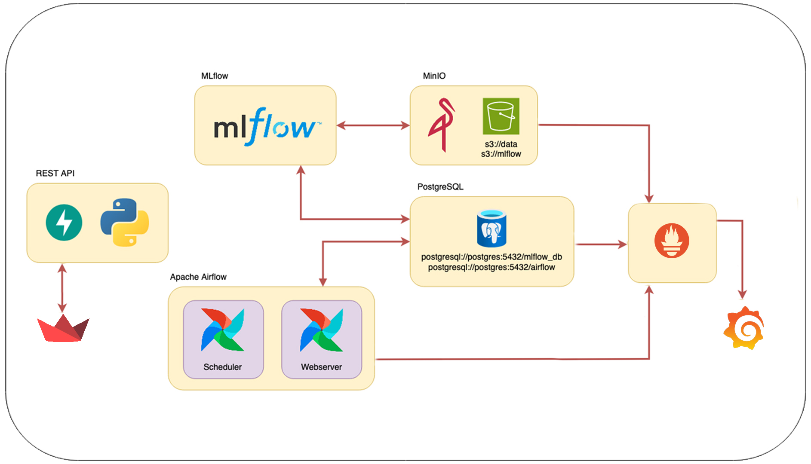

# TP Final AMq2 - CEIA - FIUBA

Integrantes:
- Julio Agustín Donadello
- Diego Braga
- Eduardo Echeverria
- Marco Joel Isidro
- Diego Sarina

## Estructura principal del repositorio

```
.
├── .gitignore
├── .gitattributes
├── LICENSE
├── poetry.lock
├── pyproject.toml
├── diagrama-servicios.png
├── README.md
│
└── servicio-ml
    ├── .env
    ├── docker-compose.yaml
    ├── LICENSE
    │
    ├── airflow
    │   ├── config/
    │   ├── dags/
    │   │   ├── etl_process.py
    │   │   ├── retrain_model.py
    │   ├── plugins/
    │   └── secrets/
    │       ├── connections.yaml
    │       └── variables.yaml
    │
    ├── dockerfiles
    │   ├── airflow/
    │   │   ├── Dockerfile
    │   │   └── requirements.txt
    │   ├── fastapi/
    │   │   ├── app.py
    │   │   ├── Dockerfile
    │   │   └── requirements.txt
    │   ├── grafana/
    │   │   ├── Dockerfile
    │   │   ├── dashboards/
    │   │   │   ├── airflow/
    │   │   │   │   ├── airflow-cluster-dashboard.json
    │   │   │   │   └── airflow-dag-dashboard.json
    │   │   │   ├── minio/
    │   │   │   │   └── minio-dashboard.json
    │   │   │   └── postgres/
    │   │   │   │       └── postgre-dashboard.json
    │   │   ├── provisioning/
    │   │       ├── dashboards/
    │   │       │   └── dashboards.yaml
    │   │       └── datasources/
    │   │           └── datasources.yaml
    │   ├── mlflow/
    │   │   ├── Dockerfile
    │   │   └── requirements.txt
    │   ├── postgres/
    │   │   ├── Dockerfile
    │   │   └── mlflow.sql
    │   ├── prometheus/
    │   │   ├── Dockerfile
    │   │   ├── config/
    │   │       └── prometheus.yml
    │   ├── statsd-exporter/
    │   │   ├── Dockerfile
    │   │   ├── config/
    │   │       └── statsd.yaml
    │   ├── streamlit/
    │       ├── app.py
    │       ├── data_overview.py
    │       ├── Dockerfile
    │       ├── requirements.txt
    │       ├── results.py
    │       ├── test_model.py
    │       ├── components/
    │       │   └── charts.py
    │       └── utils/
    │           ├── data_processing.py
    │           ├── utils.py
    │
    └── notebooks
        ├── mlflow_aux.py
        ├── optuna_aux.py
        ├── plots.py
        ├── train_rain_in_australia.ipynb
```

## Servicios

Los servicios que se implementaron fueron:
- [Apache Airflow](https://airflow.apache.org/)
- [MLflow](https://mlflow.org/)
- API Rest para servir el modelo ([FastAPI](https://fastapi.tiangolo.com/))
- [MinIO](https://min.io/)
- Base de datos relacional [PostgreSQL](https://www.postgresql.org/)
- [Grafana](https://grafana.com/)
- [Prometheus](https://prometheus.io/)
- [Streamlit](https://streamlit.io/)

Por defecto, cuando se inician los multi-contenedores, se crean los siguientes buckets:

- `s3://data`
- `s3://mlflow` (usada por MLflow para guardar los artefactos).

las siguientes bases de datos:

- `mlflow_db` (usada por MLflow).
- `airflow` (usada por Airflow).

y los volumenes para persistir los datos:

- `db_data` (usado por Postgres)
- `minio_data` (usado por MinIO)
- `prometheus_data` (usado por Prometheus)

### Integración de servicios



## Instalación

1. Instalar [Docker](https://docs.docker.com/engine/install/) en tu computadora (o en el servidor que desees usar).

2. Clona este repositorio.

3. Si estás en Linux o MacOS, en el archivo `.env`, reemplaza `AIRFLOW_UID` por el de tu  usuario o alguno que consideres oportuno (para encontrar el UID, usa el comando `id -u <username>`). De lo contrario, Airflow dejará sus carpetas internas como root y no podrás subir DAGs (en `airflow/dags`) o plugins, etc.

4. En la carpeta raíz de este repositorio, ejecutar:

```bash
docker compose --profile all up
```

5. Podrás acceder a los diferentes servicios mediante:
   - Apache Airflow: http://localhost:8080
   - MLflow: http://localhost:5000
   - MinIO: http://localhost:9001 (ventana de administración de Buckets)
   - API: http://localhost:8800/
   - Documentación de la API: http://localhost:8800/docs
   - Grafana: http://localhost:3000/
   - Stremlit: http://localhost:8501/

## Utilización

A continuación se explica como el usuario utilizara el proyecto.

### Airflow

...

### MLflow

...

### Grafana

...

### Streamlit
